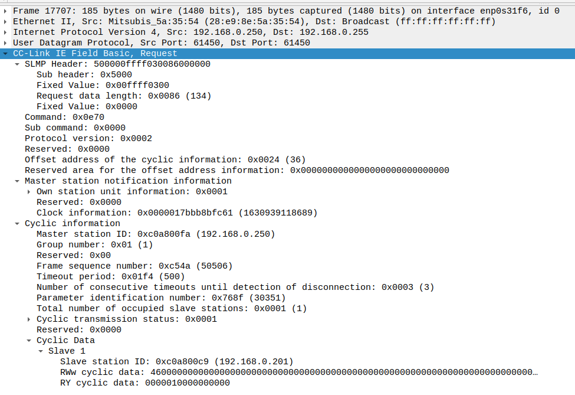
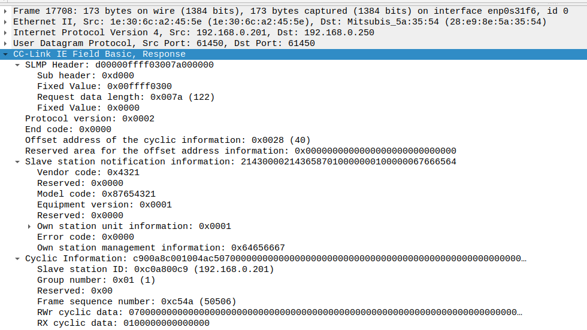
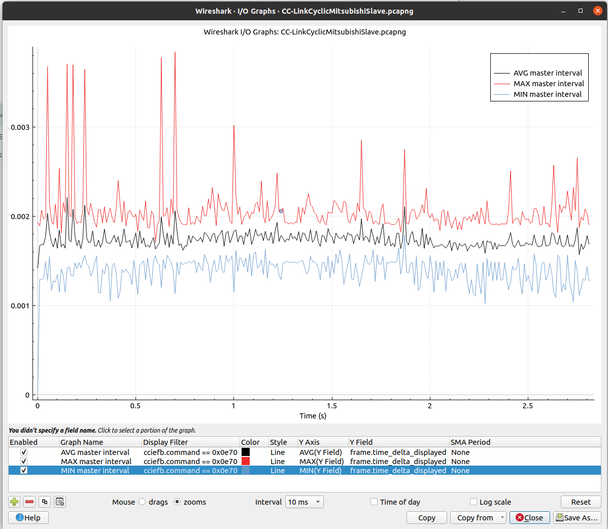
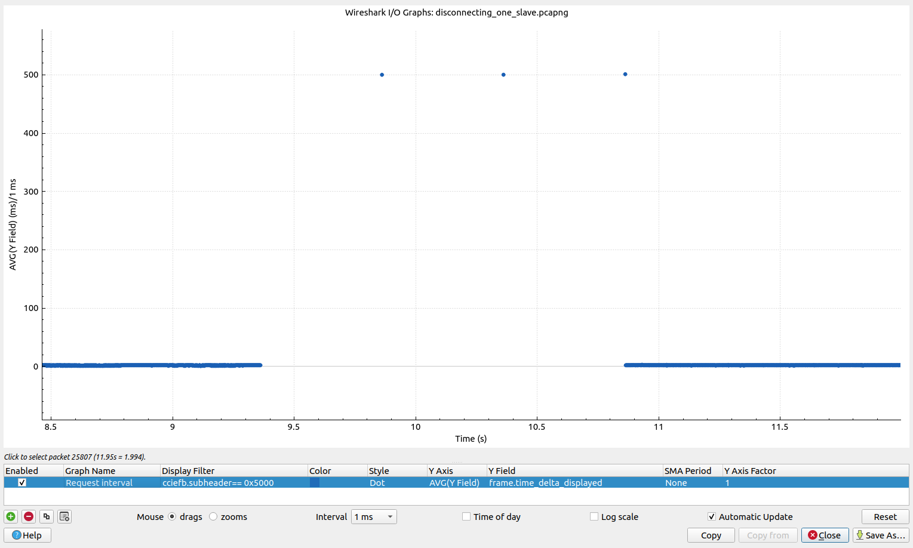
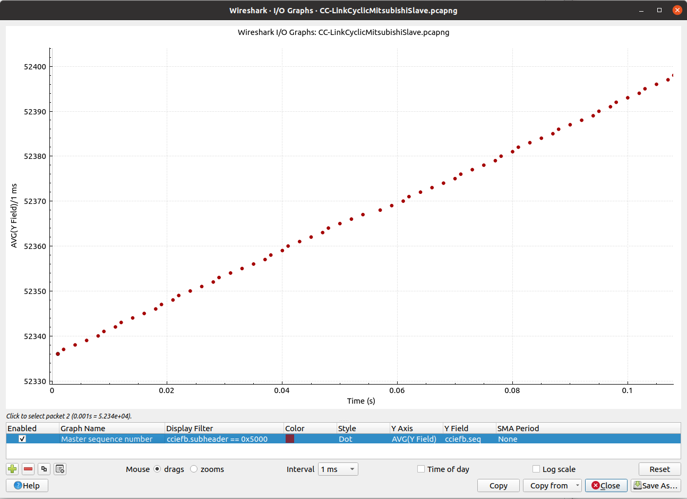
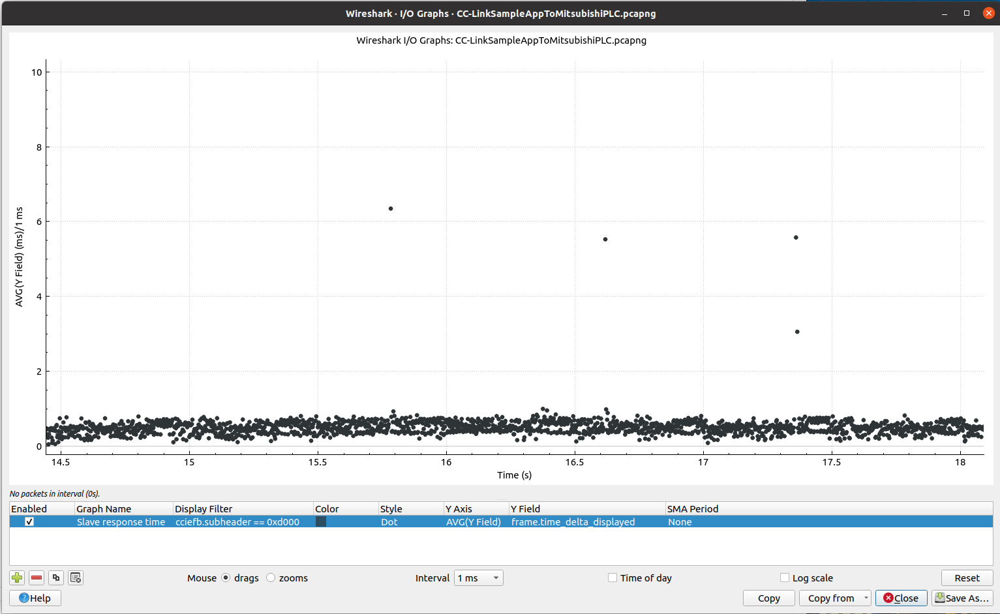

Capturing and analyzing Ethernet packets
========================================
In order to understand the CC-Link traffic, it is useful to capture network
packets and analyze them in a tool like Wireshark. You typically run
Wireshark on your laptop, but in order to capture packets on for example
a Raspberry Pi you can use the program tcpdump.

Downloading and installing Wireshark plugin for CC-Link
-------------------------------------------------------

#. There is a Wireshark plugin available for CC-Link IE Field Basic.
   Download it from https://www.cc-link.org/en/downloads/wireshark/index.html
   Note that there is another Wireshark plugin for CC-Link IE TSN, so
   make sure to use the correct one.

#. On a Linux laptop, install Wireshark plugins in your user directory:
   :file:`.local/lib/wireshark/plugins`.

   In the file :file:`/usr/share/wireshark/init.lua` make sure that::

      enable_lua = true
      run_user_scripts_when_superuser = true

#. On a Windows laptop, place the file :file:`cclink_ief_basic_ws_plugin_en.lua`
   in the directory :file:`C:\\Program Files\\Wireshark\\plugins`
   (or corresponding path on you machine).

#. Verify the installation of the plugin by typing ``cciefb`` in the filter bar,
   which should turn green.

Filtering packets
-----------------
Filtering on protocol:

======================= ====================
Filter expression       Resulting frames
======================= ====================
cciefb                  CCIEF Basic
cciefb-settings         SLMP
======================= ====================

Filtering on subheader (request and response respectively)::

   cciefb.subheader == 0x5000
   cciefb.subheader == 0xd000

Frames indicating an error::

   cciefb.endcode != 0x0000

Slave error code::

   cciefb.errorcode != 0x0000

Most of the payload is sent as little-endian.

Wireshark example frames
------------------------
See below for an example request frame sent from a PLC to a CCIEFB slave.

The corresponding response frame:

Add custom columns to the Wireshark packet list
-----------------------------------------------

In the menu :menuselection:`Edit --> Preferences --> Appearance --> Columns`
click on the ``+`` to create a new column entry.
Edit the :guilabel:`Title` text box, and use ``custom`` in the
:guilabel:`Type` text box. In the :guilabel:`Fields` text box, enter for
example ``cciefb.endcode``.
Drag the entries to change order of the columns.

Plotting master transmission time periodicity using Wireshark
-------------------------------------------------------------

#. Filter the displayed frames in the main Wireshark window to
   plot the periodicity of sent frames::

      cciefb.subheader == 0x5000

#. Use the menu "Statistics" -> "I/O Graph".

   * Display filter: ``cciefb.subheader == 0x5000``
   * Style: Line
   * Y Axis: AVG(Y Field)
   * Y Field: ``frame.time_delta_displayed``
   * SMA (sample moving average) Period: None
   * Interval: 10 or 100 ms.

#. Zoom the Y-axis to an interesting range, maybe 0-10 ms.

#. It is also interesting to add a line "MAX(Y Field)" and a line "MIN(Y Field)"
   in the same graph as the first line. See below for an example where the
   average frame interval is approximately 1.7 ms.

   The lines should be interpreted as the average, minimum and maximum
   packet-to-packet times during the interval (for example 10 ms).

Plotting master transmission time periodicity when losing a slave
-----------------------------------------------------------------

#. Filter the displayed frames in the main Wireshark window to
   plot the periodicity of sent frames::

      cciefb.subheader == 0x5000

#. Use the menu "Statistics" -> "I/O Graph".

   * Display filter: ``cciefb.subheader == 0x5000``
   * Style: Dot
   * Y Axis: AVG(Y Field)
   * Y Field: ``frame.time_delta_displayed``
   * SMA (sample moving average) Period: None
   * Interval: 1 ms.

#. Zoom the Y-axis to include the timeout value, maybe 0-550 ms.

The graph show that the transmission interval increases to 500 ms when a slave is lost.

Plotting master cycle counter
------------------------------

#. Use Wireshark to verify that the cycle counter increases between each frame.

#. Use the menu “Statistics” -> “I/O Graph”.

   * Display filter: ``cciefb.subheader == 0x5000``
   * Style: Dot
   * Y Axis: AVG(Y Field)
   * Y Field: ``cciefb.seq``
   * SMA (sample moving average) Period: None
   * Interval: 1 ms

   See the image below for an example.

Plotting slave response time
----------------------------

#. To plot the periodicity of sent frames, you first need to filter the displayed
   frames in the main Wireshark window. Use the IP address of the master and
   the slave you are interested in ::

      cciefb and (ip.src==192.168.0.250 or ip.src==192.168.0.201)

#. Then use the menu "Statistics" -> "I/O Graph".

   * Display filter: ``cciefb.subheader == 0xd000``
   * Style: Dot
   * Y Axis: AVG(Y Field)
   * Y Field: ``frame.time_delta_displayed``
   * SMA (sample moving average) Period: None
   * Interval: 1 ms.

#. Zoom the Y-axis to an interesting range, maybe 0-10 ms.

   See the image below for an example where the slave response time is around 0.5 ms,
   with a few responses delayed up to 6 ms.

Receiving UDP frames by using command line on Linux
---------------------------------------------------
Instead of using Wireshark, you can use the netcat program from command line
to verify that there are incoming frames. It will not interfere with the CCIEFB
communication.

#. To capture a single CCIEFB cyclic data request frame to file::

      nc -ul 61450 > received.cciefb

#. It will only save the UDP payload bytes. Use ``hexdump`` to
   display the contents::

      $ hexdump -Cv received.cciefb
      00000000  50 00 00 ff ff 03 00 86  00 00 00 70 0e 00 00 02  |P..........p....|
      00000010  00 00 00 24 00 00 00 00  00 00 00 00 00 00 00 00  |...$............|
      00000020  00 00 00 01 00 00 00 3f  08 f8 45 79 01 00 00 fa  |.......?..Ey....|
      00000030  00 a8 c0 01 00 77 02 f4  01 03 00 e2 3b 01 00 00  |.....w......;...|
      00000040  00 00 00 c9 00 a8 c0 00  00 00 00 00 00 00 00 00  |................|
      00000050  00 00 00 00 00 00 00 00  00 00 00 00 00 00 00 00  |................|
      00000060  00 00 00 00 00 00 00 00  00 00 00 00 00 00 00 00  |................|
      00000070  00 00 00 00 00 00 00 00  00 00 00 00 00 00 00 00  |................|
      00000080  00 00 00 00 00 00 00 00  00 00 00 00 00 00 00     |...............|
      0000008f

It is possible to listen to many frames, and to redirect the payload directly
to hexdump::

   nc -kul 61450 | hexdump -Cv

Sending UDP frames from command line on Linux
----------------------------------------------
This can be useful for firewall testing etc.

#. To send a UDP frame to the CCIEFB SLMP UDP port on another machine, from Linux::

       echo "Testdata" > /dev/udp/192.168.0.201/61451

   The ``/dev/udp`` is a Bash pseudo-device.

#. Use Wireshark (or tcpdump) on the receiving machine to verify the reception of
   the frame.

#. Enable debug logging in the c-link stack to verify that
   the frame reached the stack.
